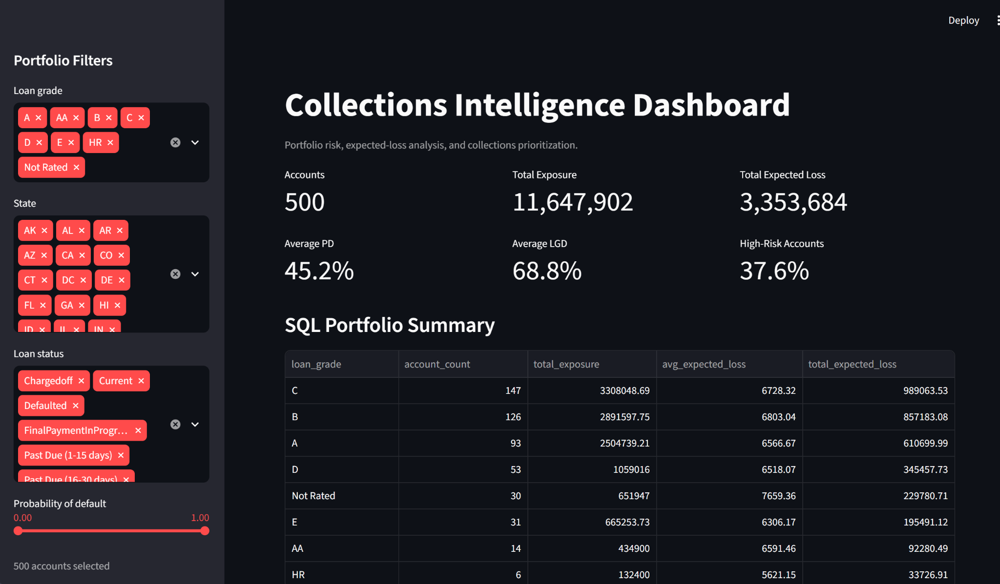

# Collections Intelligence Dashboard

### Streamlit · SQL · Credit Risk · Expected Loss · Decision Support

An end-to-end collections intelligence application built with **Python, Streamlit, SQL, and machine-learning outputs**.

The dashboard transforms account-level credit-risk predictions into operational portfolio insights, enabling collections teams to identify high-risk accounts, quantify Expected Loss exposure, segment portfolio risk, and prioritize limited collections resources.

The application also includes an **AI-assisted portfolio summary layer** that translates validated dashboard metrics into concise, business-facing interpretations.

> **Expected Loss = PD × LGD × EAD**

---

## Dashboard Preview



The dashboard provides an interactive decision-support layer across portfolio KPIs, SQL-backed summaries, risk segmentation, account prioritization, and model-derived Expected Loss metrics.

---

## Project Overview

The **Collections Intelligence Dashboard** is the stakeholder-facing presentation and decision-support layer of a broader credit-risk machine-learning workflow.

The application consumes account-level model outputs including:

- **Probability of Default (PD)**
- **Loss Given Default (LGD)**
- **Exposure at Default (EAD)**
- **Expected Loss**
- Loan grade
- Account status
- State
- Risk classification
- Collections priority information

These outputs are transformed into:

- Portfolio-level KPIs
- Interactive filtering
- SQL-backed portfolio summaries
- Risk visualizations
- Collections priority views
- AI-assisted portfolio interpretations
- Exportable account-level results

---

## Business Problem

Collections teams rarely have unlimited operational capacity.

When thousands of accounts may require attention, teams need a way to determine which accounts represent the greatest combination of:

1. **Default risk**
2. **Loss severity**
3. **Financial exposure**

Default probability alone does not capture the full economic importance of an account.

This project therefore centers prioritization around:

```text
Expected Loss = Probability of Default × Loss Given Default × Exposure at Default
```

or:

```text
EL = PD × LGD × EAD
```

Where:

- `PD` = Probability of Default
- `LGD` = Loss Given Default
- `EAD` = Exposure at Default

Expected Loss provides a financially grounded ranking signal that can be used to allocate limited collections capacity toward higher-impact accounts.

---

## Key Features

### Portfolio KPIs

The dashboard summarizes core portfolio risk metrics including:

- Total account count
- Total portfolio exposure
- Total Expected Loss
- Average Probability of Default
- Average Loss Given Default
- Percentage of high-risk accounts

---

### Interactive Portfolio Filters

Users can dynamically filter the portfolio by dimensions such as:

- Loan grade
- State
- Loan status
- Probability-of-default range

This allows the same portfolio to be analyzed at both aggregate and segment levels.

---

### SQL Portfolio Summary

A SQL-backed analytics layer supports portfolio aggregation and segmentation.

The summary view includes measures such as:

- Account count by loan grade
- Total exposure
- Average Expected Loss
- Total Expected Loss

This demonstrates the integration of **SQL analytics with a Python-based application layer** rather than relying solely on in-memory DataFrame operations.

---

### Risk Visualizations

The dashboard includes interactive visual analysis such as:

- Probability of Default distribution
- Expected Loss by loan grade
- Portfolio risk segmentation
- Risk concentration analysis
- Account-level Expected Loss analysis

These views help stakeholders identify where financial risk is concentrated across the portfolio.

---

### Collections Prioritization

Model outputs can be translated into account-level priority views using Expected Loss.

The goal is to support a practical operating question:

> **If a collections team can contact only a limited number of accounts, which accounts should receive attention first?**

The associated Expected Loss modeling project evaluates this strategy using capacity-based metrics such as **Loss@K, Capture@K, and Lift@K**.

---

### AI-Assisted Portfolio Summary

The application includes a lightweight AI-assisted interpretation layer.

Validated portfolio metrics are converted into concise business-facing observations such as:

- portfolio exposure
- Expected Loss concentration
- high-risk segments
- geographic risk concentration
- operational prioritization considerations

The AI layer is used for **metric interpretation and communication**, while the underlying calculations remain deterministic and derived from validated portfolio data.

---

### Data Export

Filtered or prioritized account-level results can be exported for:

- downstream collections workflows
- additional analysis
- stakeholder review
- operational handoff

---

## System Architecture

```text
Expected-Loss Model Outputs
            |
            v
Processed Prediction Data
            |
            v
       SQLite Database
            |
            v
        SQL Layer
            |
            v
     Python Analytics
            |
            v
   Streamlit Dashboard
        /         \
       v           v
Portfolio KPIs   Risk Visualizations
       \           /
        \         /
         v       v
   Collections Priority Views
            |
            v
   AI-Assisted Summary Layer
            |
            v
    Exportable Results
```

---

## Input Data Contract

The dashboard expects account-level prediction data containing core fields such as:

| Field | Description |
|---|---|
| `account_id` | Unique account identifier |
| `pd` | Predicted Probability of Default |
| `lgd` | Estimated Loss Given Default |
| `ead` | Exposure at Default |
| `expected_loss` | Predicted Expected Loss |
| `loan_grade` | Loan / credit-risk segment |
| `state` | Geographic segment |
| `loan_status` | Current account status |
| `risk_band` | Risk classification where available |
| `priority_rank` | Collections priority ordering where available |

Input data is validated before dashboard rendering to reduce downstream schema and data-quality errors.

---

## Example Dashboard Snapshot

The current portfolio demonstration includes:

| Metric | Value |
|---|---:|
| Accounts | **500** |
| Total Exposure | **$11.65M** |
| Total Expected Loss | **$3.35M** |
| Average PD | **45.2%** |
| Average LGD | **68.8%** |
| High-Risk Accounts | **37.6%** |

These values represent the current demonstration dataset loaded into the dashboard and may change when different prediction outputs or filters are applied.

---

## Repository Structure

```text
collections-intelligence-dashboard/
│
├── assets/
│   └── images/
│       └── dashboard_overview.png
│
├── configs/
│
├── data/
│
├── exports/
│
├── src/
│   └── dashboard/
│       ├── app.py
│       ├── ai_summary.py
│       ├── charts.py
│       └── ...
│
├── tests/
│
├── .gitignore
├── README.md
└── requirements.txt
```

---

## How to Run

### 1. Clone the repository

```bash
git clone <repository-url>
cd collections-intelligence-dashboard
```

### 2. Create a virtual environment

```bash
python -m venv .venv
```

### 3. Activate the environment

Windows:

```bash
.venv\Scripts\activate
```

macOS / Linux:

```bash
source .venv/bin/activate
```

### 4. Install dependencies

```bash
python -m pip install -r requirements.txt
```

### 5. Add `src` to the Python path

PowerShell:

```powershell
$env:PYTHONPATH=(Resolve-Path .\src).Path
```

macOS / Linux:

```bash
export PYTHONPATH="$(pwd)/src"
```

### 6. Launch the dashboard

```bash
python -m streamlit run ./src/dashboard/app.py
```

The application should open locally in your browser, typically at:

```text
http://localhost:8501
```

---

## AI Summary Configuration

The project uses the OpenAI Python package for the AI-assisted summary layer.

Install dependencies through:

```bash
python -m pip install -r requirements.txt
```

If the AI summary requires an API key, configure it through an environment variable rather than hard-coding credentials:

```text
OPENAI_API_KEY
```

API keys, `.env` files, and other credentials should **never be committed to GitHub**.

---

## Tech Stack

- **Python**
- **pandas**
- **Streamlit**
- **Plotly**
- **SQLite**
- **SQL**
- **OpenAI API**
- **YAML configuration**
- **pytest**
- **Git / GitHub**

---

## Role Within the Portfolio

This repository represents the **decision-support and stakeholder-facing layer** of a broader Expected Loss collections workflow.

### 1. Expected Loss Modeling

Estimates account-level:

```text
PD × LGD × EAD = Expected Loss
```

and evaluates capacity-constrained collections prioritization.

### 2. ML Training Pipeline

Provides modular and repeatable infrastructure for:

- data preprocessing
- feature engineering
- model training
- evaluation
- testing

### 3. Collections Intelligence Dashboard

Converts model outputs into:

- portfolio KPIs
- SQL-backed analytics
- interactive risk views
- collections prioritization
- business-facing interpretations

Together, the projects demonstrate the progression from:

```text
Business Problem
      ↓
Risk Modeling
      ↓
Training / Engineering
      ↓
Scoring Outputs
      ↓
SQL Analytics
      ↓
Interactive Decision Support
```

---

## Design Principles

The dashboard is designed around several principles:

### Business metrics before model metrics

The primary focus is on financial exposure, Expected Loss, and collections prioritization rather than presenting model statistics without operational context.

### Transparent analytics

Portfolio metrics are calculated from validated data before being presented to users or passed into the AI-assisted summary layer.

### Separation of concerns

Data loading, validation, analytics, visualization, and presentation logic are separated into modular components.

### Reproducible decision support

The goal is to provide a repeatable analytical workflow that translates model outputs into stakeholder-facing decisions.

---

## Limitations

This project is a portfolio implementation rather than a live production collections platform.

Current limitations include:

- demonstration rather than live production data feeds
- local application execution
- no enterprise authentication or authorization layer
- no live case-management system integration
- no automated production model monitoring within the dashboard itself
- AI-generated summaries should be treated as decision-support text rather than authoritative credit decisions

---

## Future Development

Potential extensions include:

- cloud deployment
- role-based access controls
- automated prediction ingestion
- scheduled portfolio refreshes
- richer SQL analytics
- account drill-down views
- model-monitoring integration
- drift alerts
- treatment-strategy recommendations
- collections capacity simulation
- experiment tracking
- API integration with downstream operational systems
